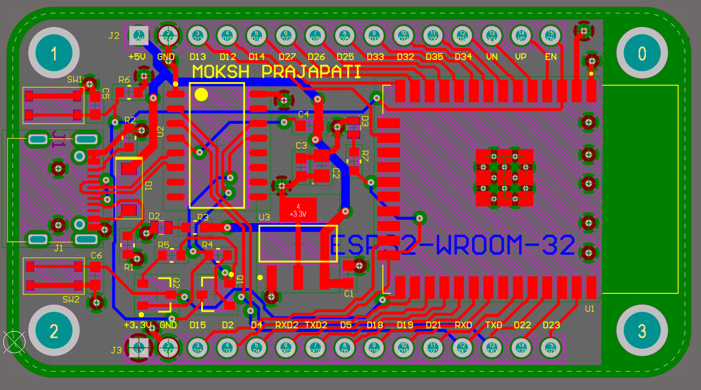
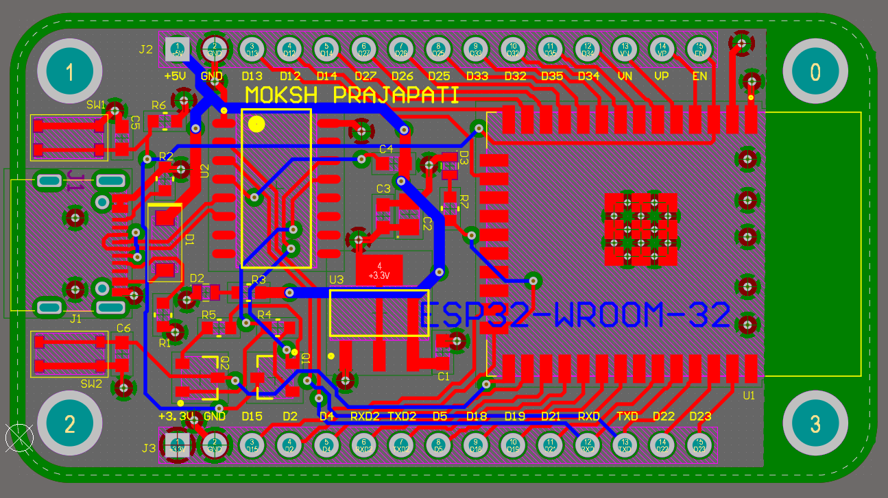
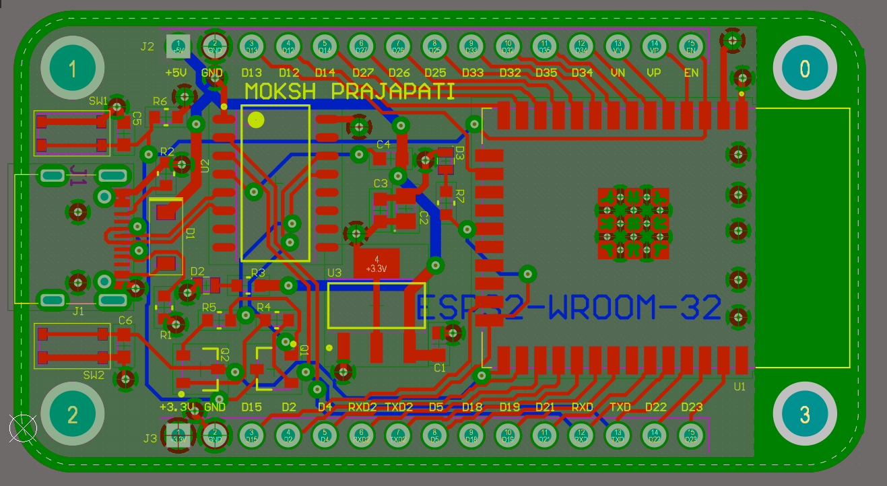
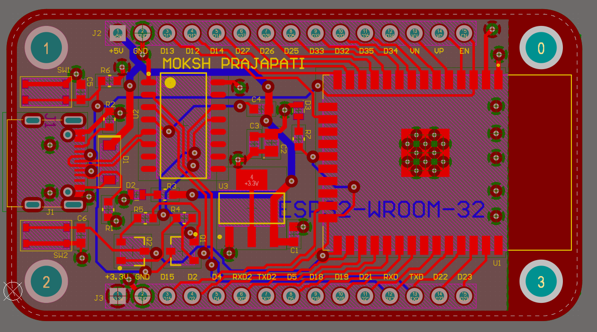
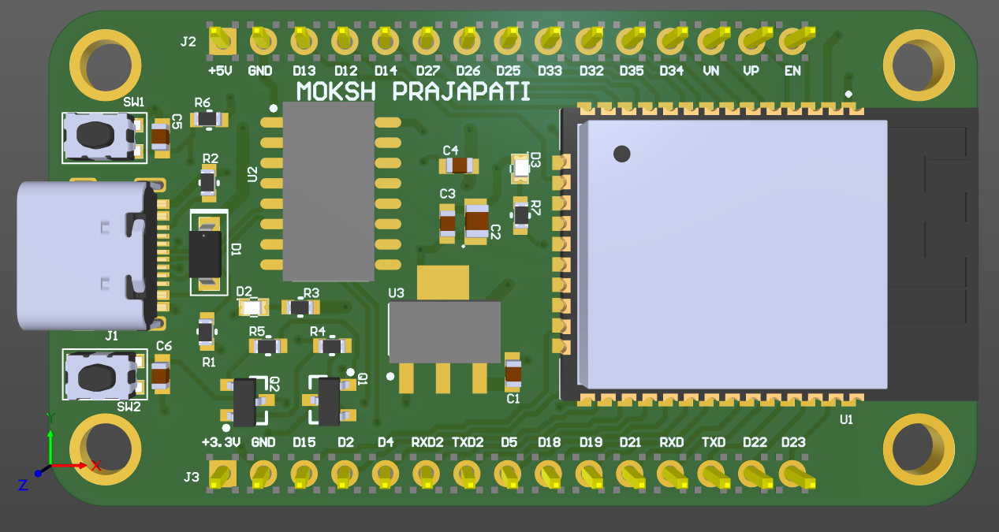
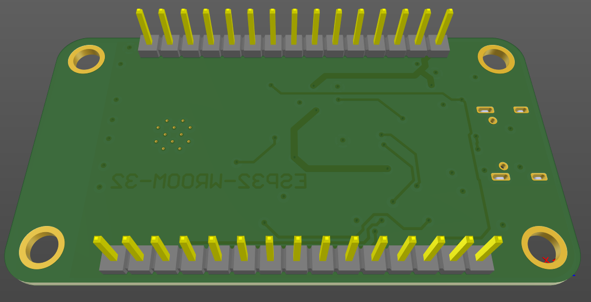
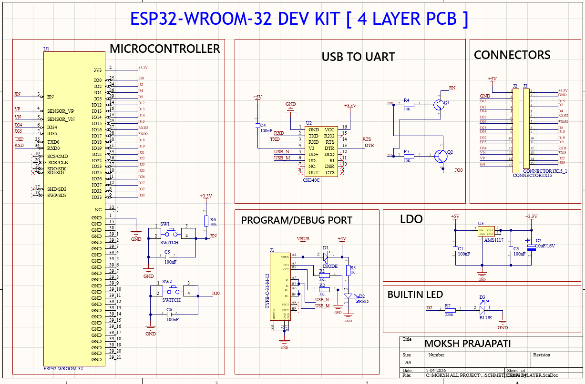

# ESP32-WROOM-32 4-Layer Development Board

> A custom **4-layer ESP32-WROOM-32 Development Board** designed using **Altium Designer 25.1**, featuring USB Type-C connectivity, CH340C USB-to-UART interface, custom schematic symbols, custom PCB footprints, dedicated power and ground planes, and manufacturing-ready outputs.

---

# Project Overview

This project presents the design and development of a custom **4-layer ESP32-WROOM-32 Development Board** intended for embedded system development, firmware programming, debugging, IoT prototyping, and hardware validation.

Unlike using pre-built libraries, all major components were implemented using **custom-created schematic symbols and PCB footprints** developed directly from manufacturer datasheets. The complete PCB design workflow was performed in **Altium Designer 25.1**, including schematic capture, PCB layout, stack-up planning, component placement, routing, ERC/DRC verification, and manufacturing file generation.

This project demonstrates practical PCB design skills used in professional hardware development.

---

# Project Specifications

| Parameter | Value |
|------------|-----------------------------|
| PCB Software | Altium Designer 25.1 |
| PCB Layers | 4 Layers |
| MCU | ESP32-WROOM-32 |
| USB Interface | USB Type-C |
| USB-UART Interface | CH340C |
| Voltage Regulator | AMS1117-3.3V |
| Programming | Auto Reset & Auto Boot Circuit |
| Design Verification | ERC Passed, DRC Passed |
| Manufacturing Output | Gerber, NC Drill, BOM |

---

# Hardware Architecture

```text
USB Type-C (5V Input)
          │
          ▼
 AMS1117-3.3V Regulator
          │
          ▼
      ESP32-WROOM-32
          │
          ▼
CH340C USB-UART Interface
          │
          ▼
EN / BOOT Control Circuit
          │
          ▼
GPIO Headers & Expansion
```

---

# Design Workflow

```text
Datasheet Analysis
        │
        ▼
Custom Schematic Symbol Creation
        │
        ▼
Custom PCB Footprint Creation
        │
        ▼
Schematic Design
        │
        ▼
Component Placement
        │
        ▼
4-Layer Stack-up Planning
        │
        ▼
Power Distribution
        │
        ▼
Signal Routing
        │
        ▼
Ground Plane Implementation
        │
        ▼
ERC Verification
        │
        ▼
DRC Verification
        │
        ▼
Gerber & BOM Generation
```

---

# Key Features

- ESP32-WROOM-32 Module Integration
- Custom Schematic Symbols
- Custom PCB Footprints
- USB Type-C Power & Programming
- CH340C USB-to-UART Interface
- AMS1117-3.3V Power Supply
- Auto Reset Circuit
- Auto Boot Programming Circuit
- EN Reset Push Button
- BOOT Push Button
- GPIO Breakout Headers
- Power Status LED
- Dedicated Ground Plane
- Dedicated Power Plane
- Manufacturing Ready PCB
- ERC Verified
- DRC Verified
- Gerber Generated
- BOM Generated

---

# PCB Stack-up

| Layer | Description |
|---------|-------------------------------|
| Top Layer | Components & Signal Routing |
| Inner Layer 1 | Solid Ground Plane |
| Inner Layer 2 | Power Plane |
| Bottom Layer | Signal Routing |

The dedicated internal power and ground planes improve current distribution, reduce return path impedance, enhance signal integrity, and provide a cleaner PCB layout.

---

# PCB Layout

## Top Layer



---

## Bottom Layer



---

## Ground Plane



---

## Power Plane



---

# 3D Visualization

## Top View



---

## Bottom View



---

# Schematic



---

# Major Components

- ESP32-WROOM-32
- CH340C USB-to-UART Converter
- AMS1117-3.3V Voltage Regulator
- USB Type-C Connector
- Push Buttons
- LEDs
- Crystal Oscillator
- Capacitors
- Resistors
- GPIO Headers

---

# Design Highlights

### Custom Library Development

Instead of using pre-built libraries, all schematic symbols and PCB footprints were created manually using manufacturer datasheets. Footprints were verified for pad dimensions, pin spacing, package outline, and mechanical accuracy before PCB implementation.

---

### PCB Layout Planning

- Functional component grouping
- Optimized component placement
- Short power traces
- Dedicated power distribution
- Clean signal routing
- Ground return optimization
- Proper via usage
- Layer-wise routing strategy

---

### Design Verification

Electrical and physical verification was performed before manufacturing file generation.

- ERC Completed
- DRC Completed
- PCB Rule Verification
- Manufacturing Output Verification

---

# Manufacturing Outputs

The repository contains complete manufacturing files including:

- Altium Project Files
- PCB Layout Files
- Schematic Files
- PCB Libraries
- Schematic Libraries
- Gerber Package
- NC Drill Files
- Bill of Materials (BOM)
- ERC Report
- DRC Report

---

# Skills Demonstrated

### PCB Design

- Multi-layer PCB Design
- Schematic Capture
- PCB Layout Design
- Component Placement
- Signal Routing
- Power Distribution
- Ground Plane Design
- Stack-up Planning
- Design Rule Verification

### Library Development

- Custom Schematic Symbol Creation
- Custom PCB Footprint Creation
- Datasheet Interpretation
- Library Management

### Hardware Design

- ESP32 Hardware Integration
- USB Interface Design
- Power Supply Design
- Embedded Hardware Design
- Auto Programming Circuit

### Manufacturing Preparation

- Gerber Generation
- BOM Generation
- Production Output Preparation
- Design Documentation

---

# Repository Structure

```
Design_Files/
Images/
Libraries/
Manufacturing_Files/
Reports/
README.md
```

---

# Future Improvements

- PCB Fabrication & Assembly
- Functional Hardware Testing
- USB ESD Protection Enhancement
- High-Speed USB Routing Optimization
- Impedance Controlled Differential Pair Routing
- EMI/EMC Performance Optimization

---

# Author

## Moksh Prajapati

Electronics Engineering Student

**Interested in**

- PCB Design
- Hardware Design
- Embedded Systems
- High-Speed PCB Design
- IoT Hardware Development

---

⭐ If you found this project useful, consider giving it a Star.
